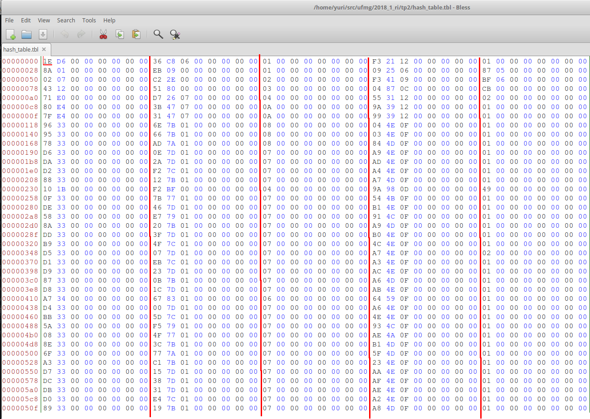
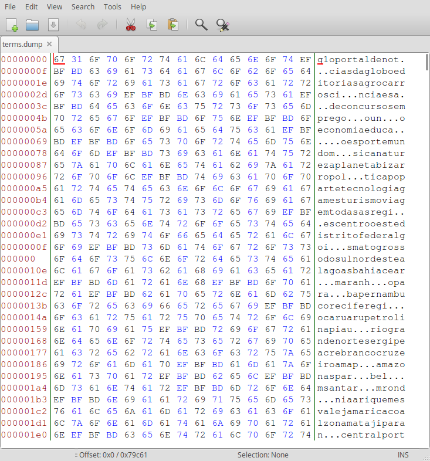
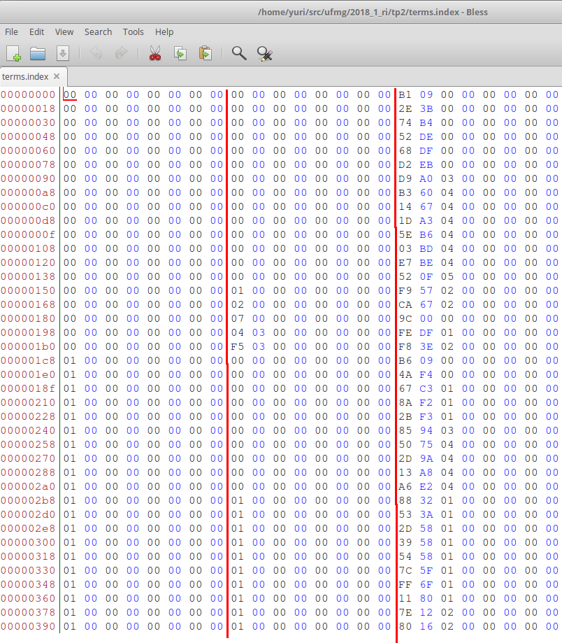
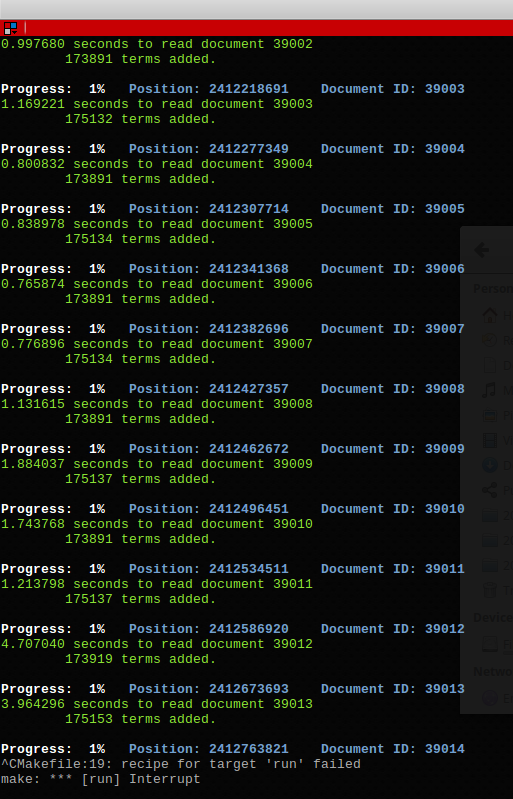
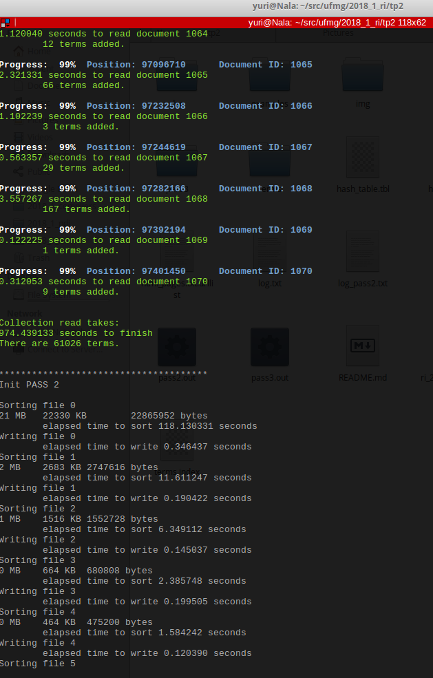
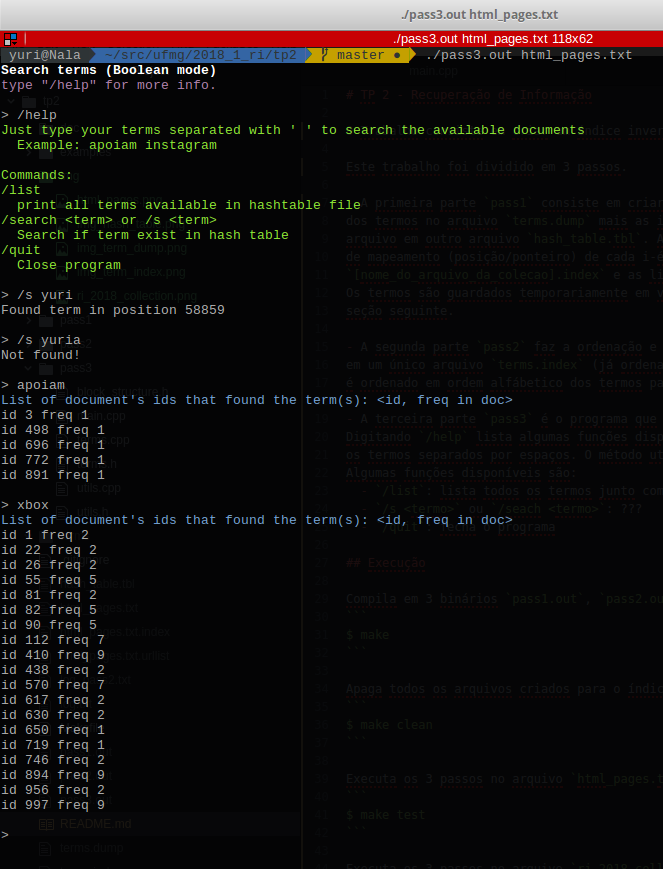
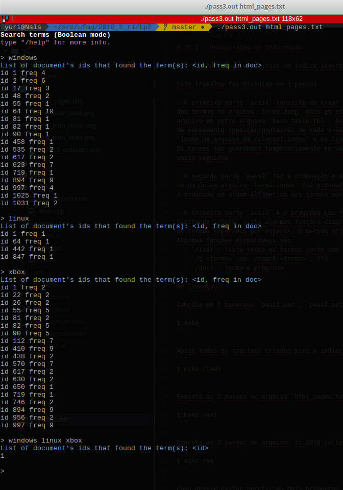
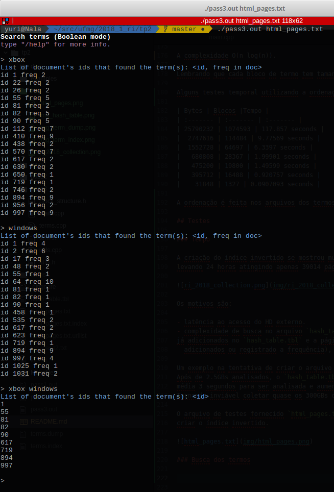

# TP 2 - Recuperação de Informação

> Yuri Diego Santos Niitsuma

O Trabalho consiste em criar um índice invertido para a coleção do TP1.

Este trabalho foi dividido em 3 passos.

- A primeira parte `pass1` consiste em criar um vocabulário guardando as strings
dos termos no arquivo `terms.dump` mais as informações de (tamanho, posição) no
arquivo em outro arquivo `hash_table.tbl`. Ao mesmo tempo que é criado um arquivo
de mapeamento (posição/ponteiro) de cada i-ésimo documento no arquivo
`[nome_do_arquivo_da_colecao].index` e as listas de URLs em `[nome_do_arquivo_da_colecao].urlist`.
Os termos são guardados temporariamente em vários arquivos na pasta `terms` que será descrito na
seção seguinte.

- A segunda parte `pass2` faz a ordenação e a união dos arquivos na pasta `terms`
em um único arquivo `terms.index` (já ordenado). Nesta etapa o arquivo `hash_table.tbl` também
é ordenado em ordem alfábetico dos termos para uma busca binária.

- A terceira parte `pass3` é o programa que faz as consultas dos termos no índice invertido.
Digitando `/help` lista algumas funções disponíveis. Para efetuar uma busca basta digitar
os termos separados por espaços. O método utilizado é a busca booleana.
Algumas funções disponíveis são:
  - `/list`: lista todos os termos junto com sua frequência totais
  - `/s <termo>` ou `/seach <termo>`: ???
  - `/quit`: fecha o programa

## Execução

Compila em 3 binários `pass1.out`, `pass2.out` e `pass3.out`.
```
$ make
```

Apaga todos os arquivos criados para o índice invertido e os binários executáveis.
```
$ make clean
```

Executa os 3 passos no arquivo `html_pages.txt` (estimado 16 minutos utilizando um SSD)
```
$ make test
```

Executa os 3 passos no arquivo `ri_2018_collection.dat` (não faça isso)
```
$ make run
```

Caso deseje evitar repetir os dois primeiros passos e executar diretamente o passo 3. Execute
```
$ ./pass3.out <nome_do_arquivo_da_colecao>
```

## Estrutura dos arquivos

Todos os arquivos são armazenados no formato Endianness da máquina rodada.
Nos exemplos seguintes os dados são descritos em Little Endian.

### [nome_do_arquivo].urllist

Arquivo contendo lista de URLs coletadas e separados por um '\n'.
Será útil no próximo trabalho prático.

### [nome_do_arquivo].index

Arquivo que mantém informações das posições da URL do no arquivo **[nome_do_arquivo].urllist**
e a posição do conteúdo do HTML no arquivo da coleção.

| pointer to URL | pointer to HTML content     |
| :------------- | :------------- |
| 00 00 00 00 00 00 00 00       | 10 00 00 00 00 00 00 00       |
| 0D 00 00 00 00 00 00 00       | 61 2B 05 00 00 00 00 00       |
| ...       | ...       |

Os ponteiros apontam para a posição no arquivo da coleção utilizada no TP1.

```
|||github.com|<HTML> XXX </HTML>|||youtube.com|<HTML> XXX </HTML>|||
...
showshow.com|<HTML> XXX </HTML>|||
```

O i-ésimo documento é indicado ordenadamente neste arquivo. Iniciando do 0.

### hash_table.tbl

Estrutura serve pra mapear o ID (**hash_id**) e a posição (**position**) da
string do termo com tamanho **chars_length** no arquivo **terms.dump**.

O **hash_id** é uma identificação única para cada termo.

```cpp
struct HashBlock {
  size_t hash_id;  // unique id of term
  size_t position; // position to char dump
  size_t chars_length; // length of term
  size_t pointer_to_term; // ponteiro para o block do termo
  size_t freq; // freq of term on all documents
};
```

Exemplo antes da ordenação

| hash_id | position | chars_length | pointer_to_term | freq |
| :------- | :------- | :------- | :------- | :------- |
| 0      | 0       | 3      | 0 | 50 |
| 1      | 3       | 10      | 50 | 11 |
| 2      | 13       | 6      | ... | 13 |
| ...      | ...       | ...      | ... | ... |
| n | position(n) | size(n) | ... | 5 |

Exemplo após a ordenação, observe que os **hash_ids** (8 bytes da esquerda) estão aparentemente,
aleatórios. Como descrito anteriormente, a ordenação foi alfabética consultando o `terms.dump`.



### terms.dump

Contém strings concatenadas para consulta utilizando parâmetros do arquivo **hash_table.tbl**.

```
<term1><term2><term3>...<termN>
```




### coleção de termos na pasta terms

Esta pasta serve para armazenar a frequência e posição do termo no HTML do
arquivo da coleção (não é a posição na coleção).

Ele segue a estrutura:

```cpp
struct {
  size_t hash_id;
  size_t document_id;
  size_t position;
};
```

| hash_id        | document_id       | position           |
| :------------- | :------------- | :------------- |
| 00 00 00 00 00 00 00 00 | 00 00 00 00 00 00 00 00 | B1 09 00 00 00 00 00 00 |
| 01 00 00 00 00 00 00 00 | 00 00 00 00 00 00 00 00 | B6 09 00 00 00 00 00 00 |
| ... | ... | ... |

Cada termo tem um ID único (**hash_id**) para evitar criar um arquivo
e evitar *paddings* dos arquivos no sistema operacional. Para cada termo é
dividido em blocos na pasta termos decidido pelo.

`(hash_id / MANY_ON_DAT_BLOCK)`

**MANY_ON_DAT_BLOCK**
`MANY_ON_DAT_BLOCK` é definido no **term_manage.h**.
Os primeiros `MANY_ON_DAT_BLOCK` termos são armazenados no arquivo **0**.
Os próximos `MANY_ON_DAT_BLOCK` no **1** e assim por diante.

Observe que como a varredura segue sequencialmente nos documentos, o document_id
será ordenado nestes arquivos.

Após o primeiro passo, é feito a ordenação em cada arquivo temporário e depois
é feito a junção em um único arquivo `terms.dump`.

A ordenação utilizada nestes arquivos é feito utilizando MergeSort externo interativo.



## Ordenação

A ordenação é feita utilizando apenas o acesso ao disco.

### Merge Sort Externo

A complexidade O(n log(n)).

Lembrando que cada bloco de termo tem tamanho de 24 bytes.

Alguns testes temporal utilizando a ordenação.

| Bytes | Blocos |Tempo |
| :------- | :------- | :------- |
| 25790232 | 1074593 | 117.857 seconds |
|  2747616 | 114484 | 9.77569 seconds |
|  1552728 | 64697 | 6.3397 seconds |
|   680808 | 28367 | 1.99901 seconds |
|   475200 | 19800 | 1.49599 seconds |
|   395712 | 16488 | 0.920757 seconds |
|    31848 | 1327 | 0.0907093 seconds |

A ordenação é feita nos arquivos dos termos e no hash_table.tbl (alfabeticamente).

## Testes

### Tempo

A criação do índice invertido se mostrou muito lenta no arquivo `ri_2018_collection.dat`,
levando 24 horas atingindo apenas 39014 páginas analisadas.



Os motivos são:

- latência ao acesso do HD externo.
- complexidade de busca no arquivo `hash_table.tbl` a cada termo. Se tiver **n** termos
já adicionados no `hash_table.tbl` e a página provem **m** termos candidatos (que podem ser
  adicionados ou registrado a frequência), temos uma complexidade *O(nm)* por página.

Um exemplo na tentativa de criar o arquivo invertido no `ri_2018_collection.dat`.
Após de 2.5GBs analisados, o `hash_table.tbl` se encontrava com 34MB e cada página levava em
média 3 segundos para ser analisada e aumentando logaritmicamente conforme o arquivo crescia.
Tornando inviável coletar quase os 300GBs do arquivo.

O arquivo de testes fornecido `html_pages.txt` contendo 93MB gastam 16 minutos para
criar o índice invertido.



### Busca dos termos

Seguem *screenshots* com exemplos do programa `pass3`.

#### Busca simples de um termo


#### Busca com 3 termos simultâneos


#### Busca com 2 termos simultâneos

